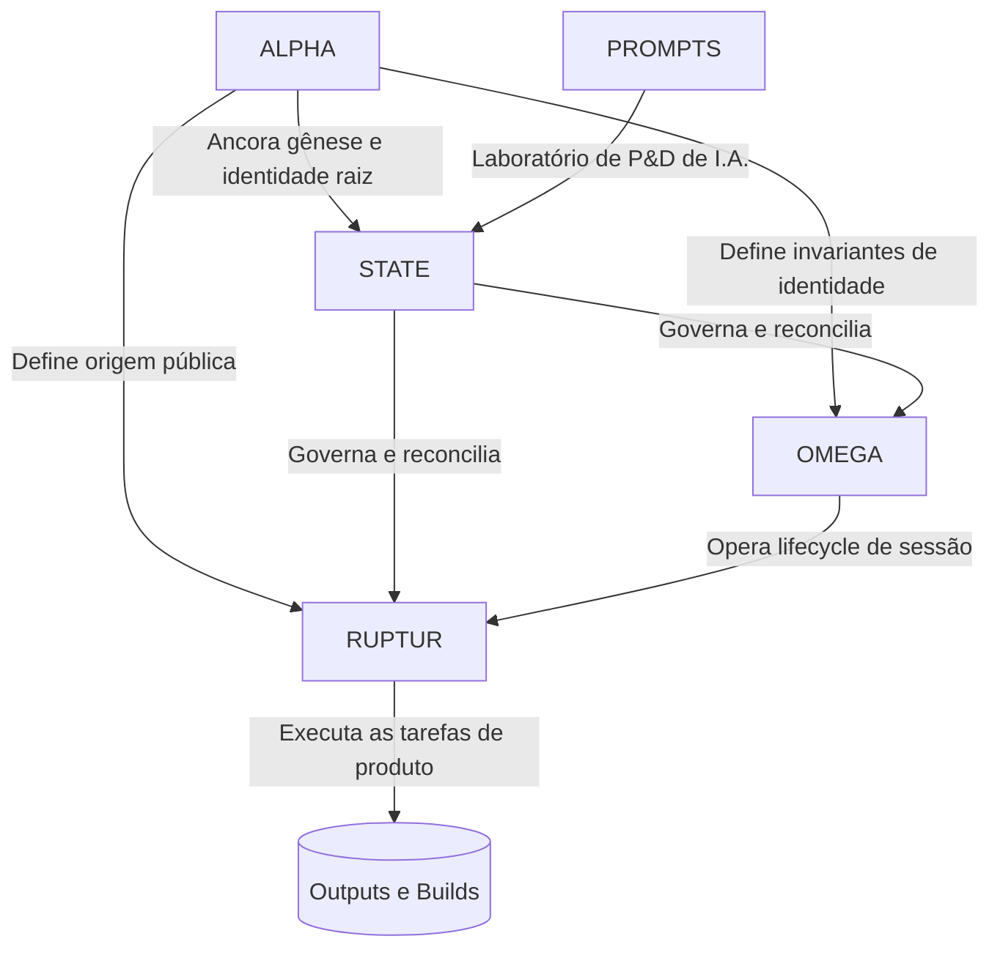

# Topologia do Ecossistema TiatendeAI

Este documento é a visão macro-arquitetural de como os repositórios em máquina e as instâncias lógicas se associam.

## 🗺️ Mapa de Camadas

## 📚 Repositórios Core

### 1. `alpha` (Camada de Gênese / Root Identity)
- Repositório de gênese, bootstrap e identidade raiz do Jarvis.
- **Autoridade de Escopo**: define origem pública, prova de gênese, pré-existência e fronteira com o restante do ecossistema.

### 2. `state` (Camada Canônica / Governança)
- Centraliza guardrails, memória curada, contexto, registries institucionais e reconciliação de verdade entre repositórios.
- **Autoridade Final**: resoluções que modificam comportamento institucional do ecossistema vêm daqui.

### 3. `omega` (Camada de Sessão / Replay / Recovery)
- Repositório destinado ao lifecycle de sessão, replay, recovery e continuidade operacional entre ciclos de trabalho.
- **Restrição**: sessão não redefine identidade raiz; opera sobre os invariantes do Alpha sob governança do State.

### 4. `codex/ruptur` (Camada Motor / Manifestação Operacional)
- Repositório contendo a manifestação operacional do Jarvis, automações, connectome, código de execução e trunk de operação.
- **Restrição**: o runtime não cria nova entidade; deve refletir as decisões de governança e preservar os invariantes identitários.

### 5. `ruptur-prompts` (Camada R&D / Sandbox)
- Repositório contendo iterações, padrões brutos e pesquisas experimentais em LLMs e multiagentes.
- **Ciclo Operacional**: o que for testado aqui e comprovar viabilidade estrutural com resultado predizível ganha formalização no `state` e, quando necessário, referência em Alpha, Omega ou Ruptur.

---

## 🧠 Contextos e Inteligência (Migração 2026-03-23)

Artefatos consolidados e migrados do repositório `codex/ruptur` para o `state` como parte da centralização da governança canônica.

### `contexts/`

#### `conselho_de_guerra/` — Base de Conhecimento Modular RAG
Repositório unificado de inteligência de auditoria, estratégia e produto, reorganizado em 8 módulos semânticos para consumo pelos agentes Matuzas e pelo ecossistema State.

| Módulo | Domínio |
|--------|---------|
| `01_inteligencia_financeira` | Auditoria, Contabilidade, IFRS/CPC |
| `02_governanca_e_padronizacao` | ISO 9001, Normas, Compliance |
| `03_visao_de_produto_e_market_fit` | SaaS, Lean Startup, Growth |
| `04_arquitetura_e_automacao_ti` | n8n, Prompts, Infraestrutura |
| `05_compliance_e_direito_digital` | LGPD, Contratos, Direito |
| `06_capacitacao_e_treinamento` | Educação, Playbooks, Vendas |
| `07_inteligencia_de_mercado_e_leads` | Mineração, Scraping, Leads |
| `08_psicologia_e_lideranca_estrategica` | Mindset, Liderança, Ética |

- Contém `llms.txt` para roteamento RAG inteligente.
- Contém `conselho_de_guerra_index.md` como mapa navegável.

#### `ruptur_operational_truth.md` — Verdade Operacional
Fonte canônica da verdade operacional do sistema Ruptur (ex-CONTEXT7). Define o time operacional, estado validado de instâncias (UAZAPI/Baileys), jornada do assistente, regras de engenharia e uso de OpenAI. **Deve ser lido por qualquer agente antes de implementações relevantes.**

### `constitution/`

#### `jarvis_protocol.md` — Protocolo de Ativação e Identidade Jarvis
Ponto de entrada obrigatório para agentes. Define a hierarquia de reconhecimento (Alpha → State → Omega → Ruptur), menu de ativação e referências canônicas de identidade.

### `infrastructure/`

#### `vps_topology.md` — Topologia de Servidores VPS
Dados de acesso SSH e configuração das VPS ativas do ecossistema (VPS1: Ubuntu 24.04, VPS2: Ubuntu 20.04).

### `archives/hotfixes/`

#### `2026-03_kvm2_auth.md` — Hotfix de Autenticação KVM2
Registro histórico da intervenção tática no servidor KVM2 para correção de autenticação Supabase e auditoria de produção.
