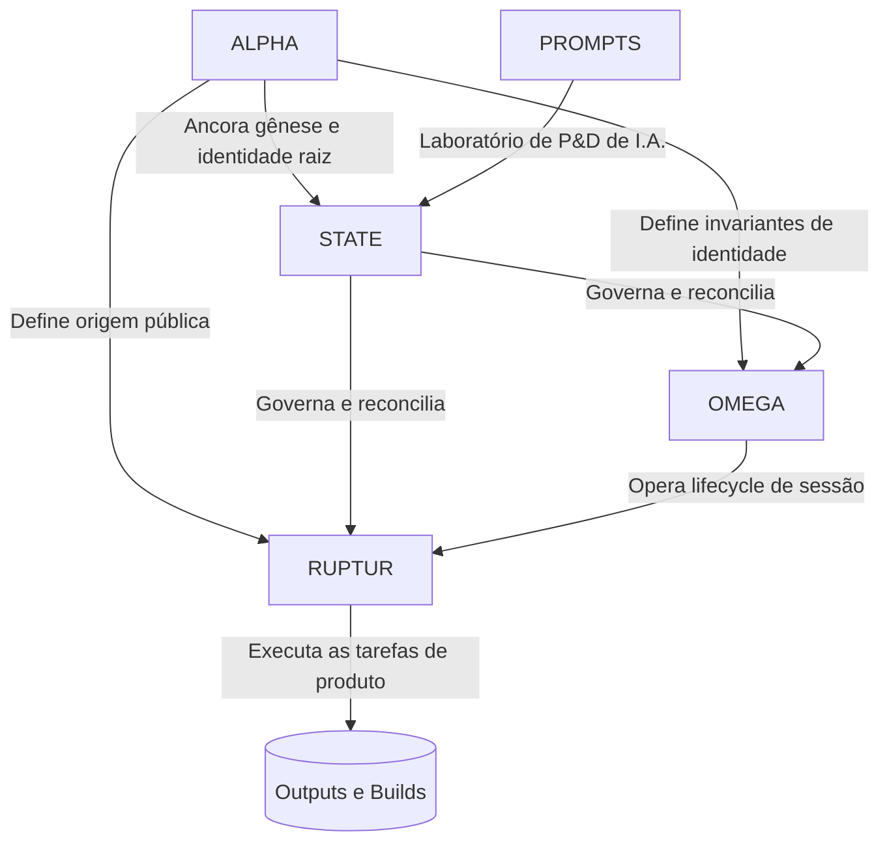

# Topologia do Ecossistema TiatendeAI

Este documento é a visão macro-arquitetural de como os repositórios em máquina e as instâncias lógicas se associam.

## 🗺️ Mapa de Camadas

## 📚 Repositórios Core

### 1. `alpha` (Camada de Gênese / Root Identity)
- Repositório de gênese, bootstrap e identidade raiz do Jarvis.
- **Autoridade de Escopo**: define origem pública, prova de gênese, pré-existência e fronteira com o restante do ecossistema.

### 2. `state` (Camada Canônica / Governança)
- Centraliza guardrails, memória curada, contexto, registries institucionais e reconciliação de verdade entre repositórios.
- **Autoridade Final**: resoluções que modificam comportamento institucional do ecossistema vêm daqui.

### 3. `omega` (Camada de Sessão / Replay / Recovery)
- Repositório destinado ao lifecycle de sessão, replay, recovery e continuidade operacional entre ciclos de trabalho.
- **Restrição**: sessão não redefine identidade raiz; opera sobre os invariantes do Alpha sob governança do State.

### 4. `codex/ruptur` (Camada Motor / Manifestação Operacional)
- Repositório contendo a manifestação operacional do Jarvis, automações, connectome, código de execução e trunk de operação.
- **Restrição**: o runtime não cria nova entidade; deve refletir as decisões de governança e preservar os invariantes identitários.

### 5. `ruptur-prompts` (Camada R&D / Sandbox)
- Repositório contendo iterações, padrões brutos e pesquisas experimentais em LLMs e multiagentes.
- **Ciclo Operacional**: o que for testado aqui e comprovar viabilidade estrutural com resultado predizível ganha formalização no `state` e, quando necessário, referência em Alpha, Omega ou Ruptur.
