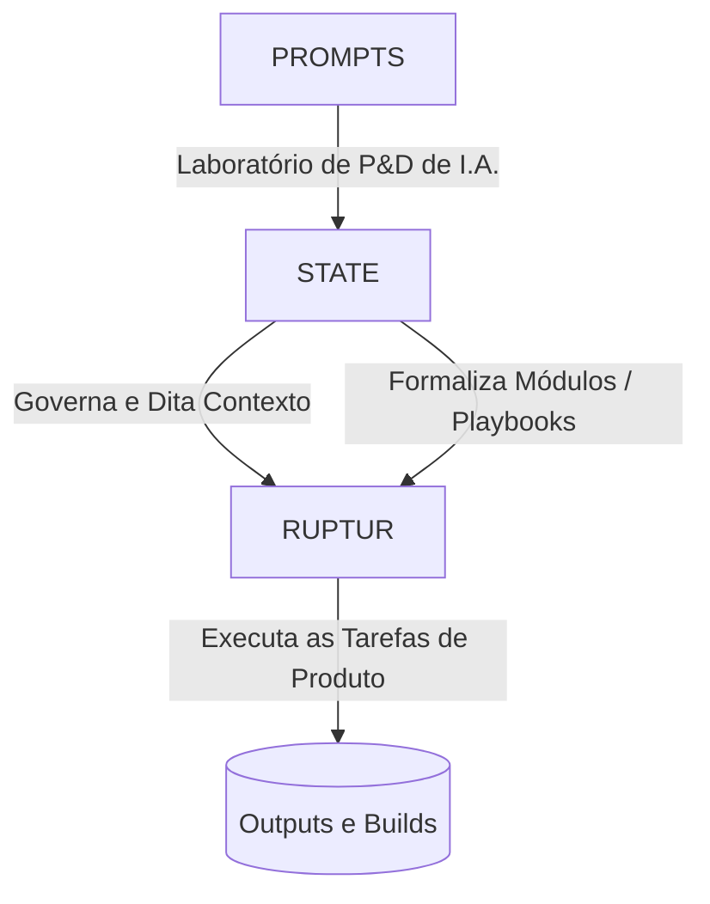

# Topologia do Ecossistema TiatendeAI

Este documento é a visão macro-arquitetural de como os repositórios em máquina e as instâncias lógicas se associam.

## 🗺️ Mapa de Camadas

## 📚 Repositórios Core

### 1. `state` (Camada Canônica / Brain)
- A base do Triângulo. Centraliza padrões, processos, playbooks operacionais, memória validada e decisões de alto nível.
- **Autoridade Final**: Resoluções tomadas que modificam comportamento do ecossistema vêm daqui.

### 2. `codex/ruptur` (Camada Motor / Implementation)
- Repositório contendo o agente Jarvis, a suíte de expansão `Antigravity Kit`, os scripts Pydantic/Python de automação, RAG e banco local.
- **Restrição**: Código lá deve estar refletindo as decisões no `state`. O `.agent/ARCHITECTURE.md` é a execução da topologia, não sua criação de princípio.

### 3. `ruptur-prompts` (Camada R&D / Sandbox)
- Repositório contendo iterações, padrões brutos e pesquisas em "Large Language Models" como "ConcursoGPT", "Vendedor", "Multiagentes em Debate", etc.
- **Ciclo Operacional**: O que for testado aqui e comprovar viabilidade técnica estrutural com resultado predizível ganha formalização no `state/patterns` ou `state/playbooks`.
